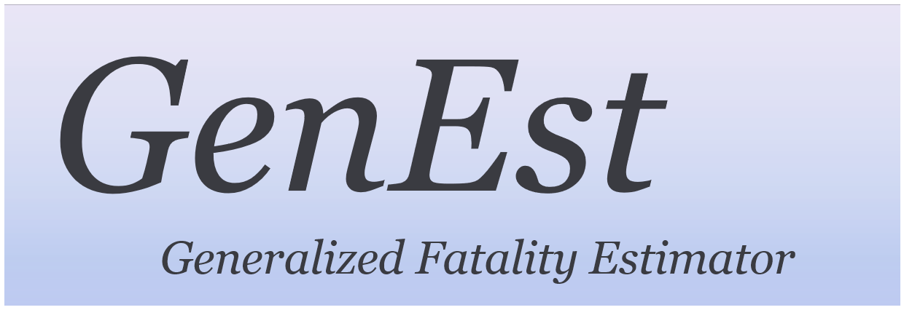

## GenEst: Generalized Fatality Estimator    

[](https://travis-ci.org/ddalthorp/GenEst)
[-blue.svg)](https://raw.githubusercontent.com/ddalthorp/GenEst/master/LICENSE)

**GenEst** is a tool for estimating fatalities from efficiency, persistence,
and carcass data.

## DISCLAIMER

This software is preliminary or provisional and is subject to revision. It is
being provided to meet the need for timely best science. The software has not
received final approval by the U.S. Geological Survey (USGS). No warranty,
expressed or implied, is made by the USGS or the U.S. Government as to the
functionality of the software and related material nor shall the fact of release
constitute any such warranty. The software is provided on the condition that
neither the USGS nor the U.S. Government shall be held liable for any damages
resulting from the authorized or unauthorized use of the software.

## Installation

You can install the in-development version of **GenEst** using a few different
options, all of which assume you have installed 
[**R**](https://www.r-project.org/)

### Windows Base User

Windows users who are not familiar with R development should [download the 
zipped package](https://github.com/ddalthorp/GenEst/raw/master/GenEst.zip) and
then in an instance of **R** run 
```
utils:::menuInstallLocal()
```
and point to the zipped file. Once it is finished installing, run

```
install.packages("devtools")
devtools::install_deps(paste0(.libPaths()[1], "/GenEst"))
```

### Windows Development-Savvy User

Windows users who are familiar with R development should first ensure that
they have [Rtools](https://cran.r-project.org/bin/windows/Rtools/) installed 
on their machine and then can simply run
```
install.packages("devtools")
devtools::install_github("ddalthorp/GenEst")
```

### Mac/Linux User

Mac and Linux users can simply run

```
install.packages("devtools")
devtools::install_github("ddalthorp/GenEst")
```

## GUI

Having installed **GenEst**, you can launch the app in **R** by running

```
GenEst::runGenEst()
```

## Support

The development of GenEst is being supported by [The US Bureau of Land
Management](https://www.blm.gov/), [The US Geological
Survey](https://www.usgs.gov/), the [National Renewable Energy 
Laboratory](https://www.nrel.gov/),
[WEST](http://www.westconsultants.com/), [Bat Conservation
International](http://www.batcon.org/), [American 
Wind Wildlife Institute](https://awwi.org/), [Avangrid 
Renewables](http://www.avangridrenewables.us/), and [Oregon State
University](https://oregonstate.edu/). 

## Authors

Daniel Dalthorp ([USGS](https://www.usgs.gov/)), Juniper Simonis ([DAPPER
Stats](http://www.dapperstats.com)), Lisa Madsen ([OSU](https://oregonstate.edu/)),
Paul Rabie ([WEST](http://www.westconsultants.com/)), Jared Studyvin
([WEST](http://www.westconsultants.com/)), Robert Wolpert 
([Duke](http://www2.stat.duke.edu/~rlw/)), Franzi Korner-Nievergelt 
([oikostat](http://www.oikostat.ch/)) and Manuela Huso 
([USGS](https://www.usgs.gov/)).

<br><br>
<a href="https://www.blm.gov/">
 
</a>
         
